# Expense & Income Tracker App

[](https://opensource.org/licenses/MIT)
[](https://reactnative.dev/)
[]()

---

## Description
**Expense & Income Tracker App** is a React Native mobile application developed based on a Figma design by Sparktech Agency.  
The app provides an intuitive UI to track expenses and income.  
Buttons and navigation elements work, but no backend or data persistence is implemented.

**Figma Design:** [View Figma](https://www.figma.com/design/XQ4Xd5KXuYG7m1kh2Pzabr/Home-Savings---Budgeting-App?node-id=2-3&p=f&t=UzV8ibUta3gNJzDe-0)

---

## Features
- Clean and responsive UI matching the Figma design  
- Navigation between Home, Income, Expense, and Summary screens  
- Interactive buttons for easy navigation  
- Lightweight and extendable architecture  

---

## Screenshots
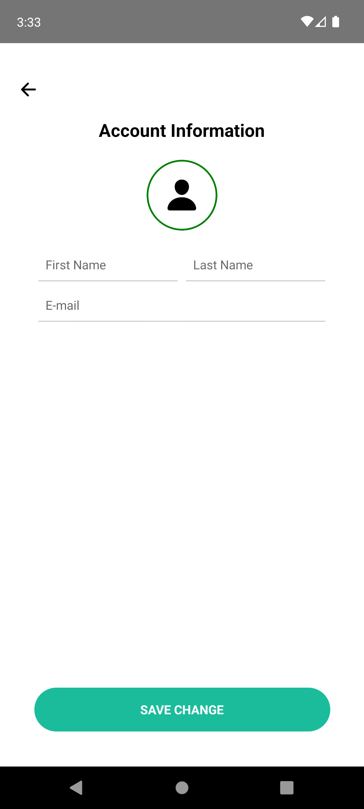  
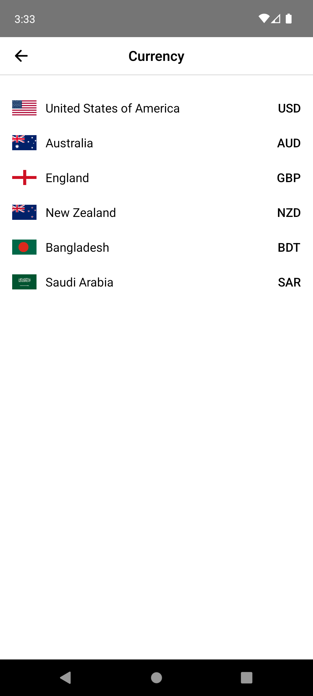  
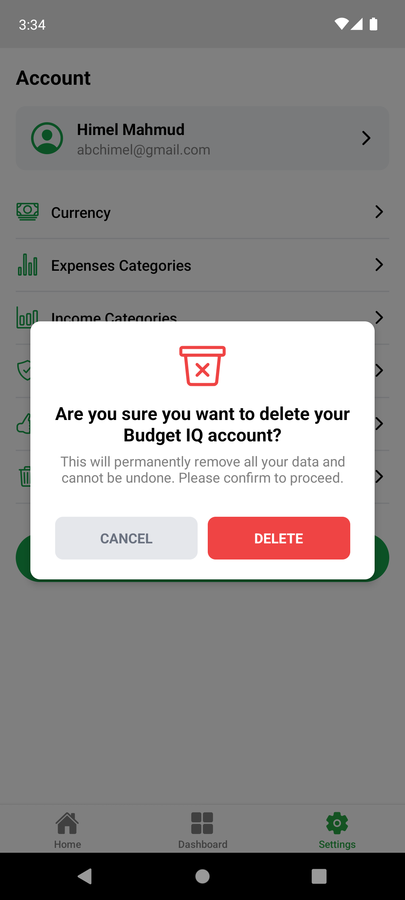  
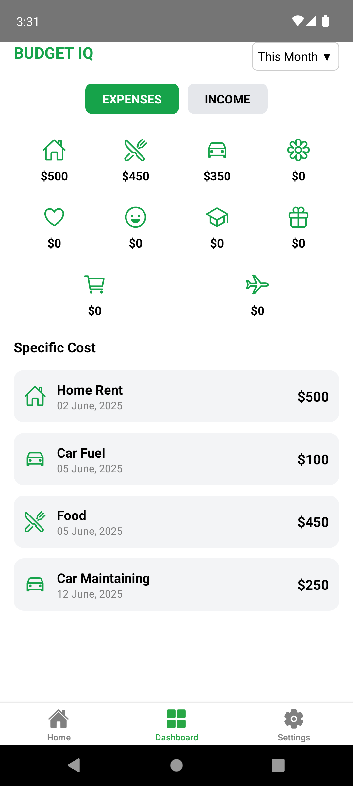  
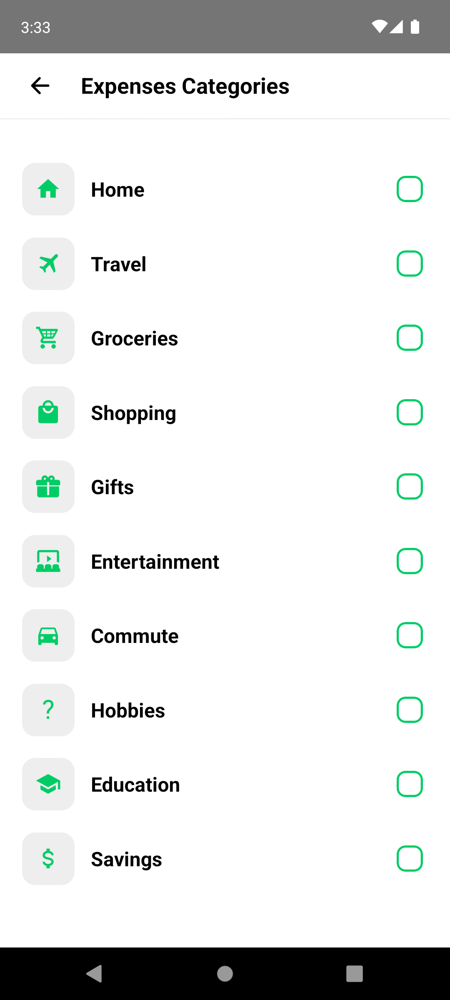  
  
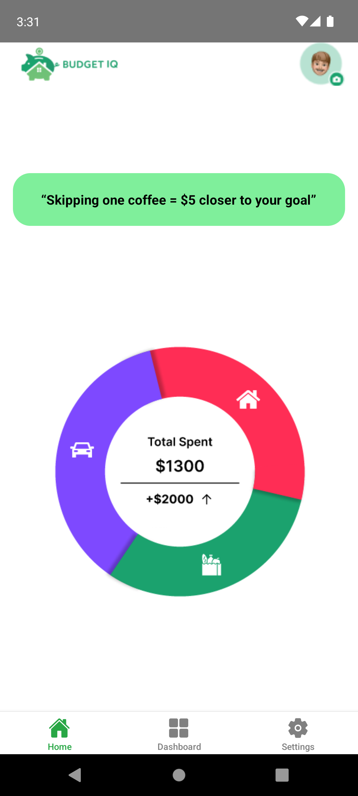  
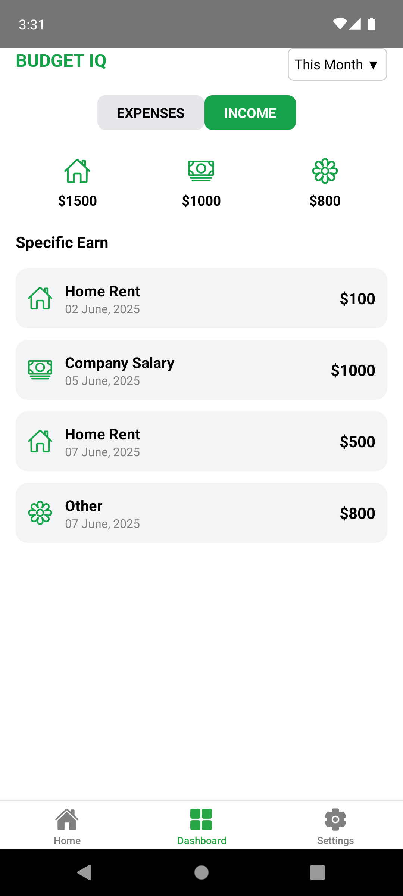  
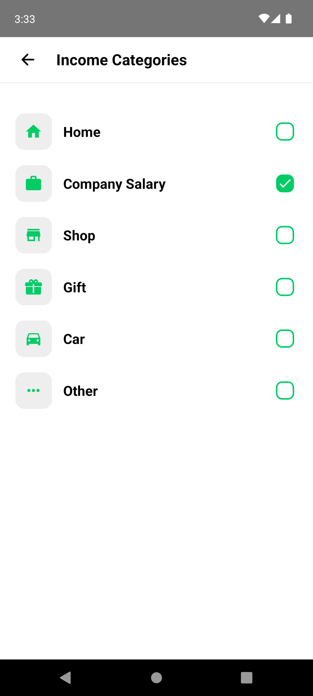  
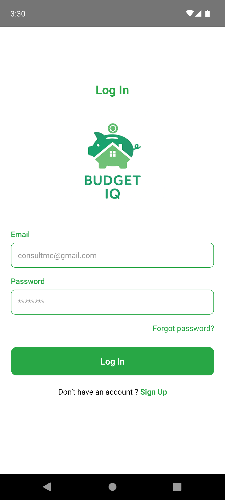  
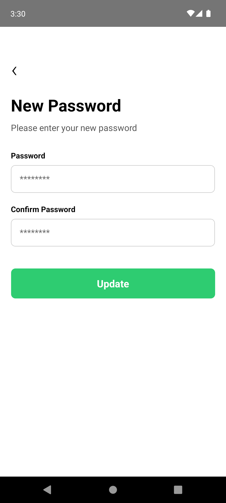  
  
  
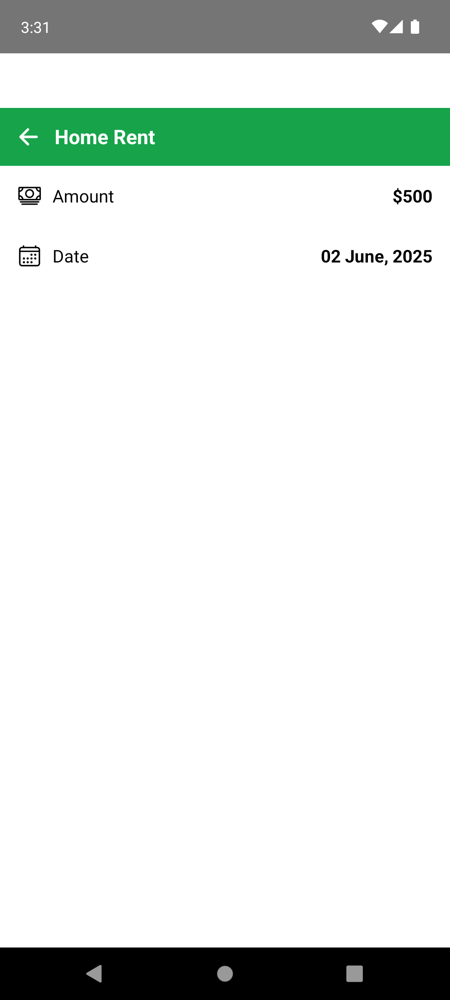  
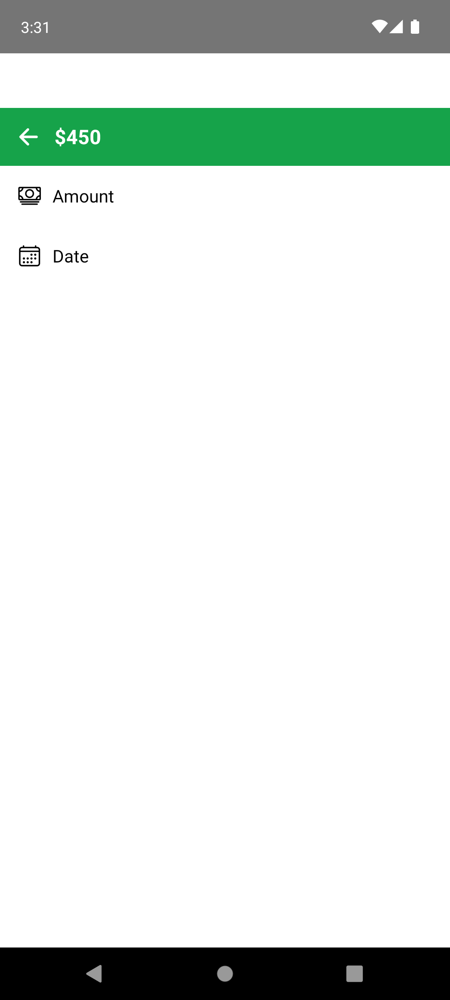  
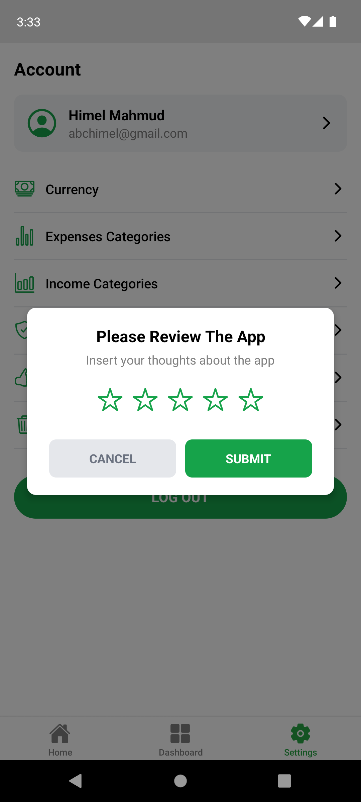  
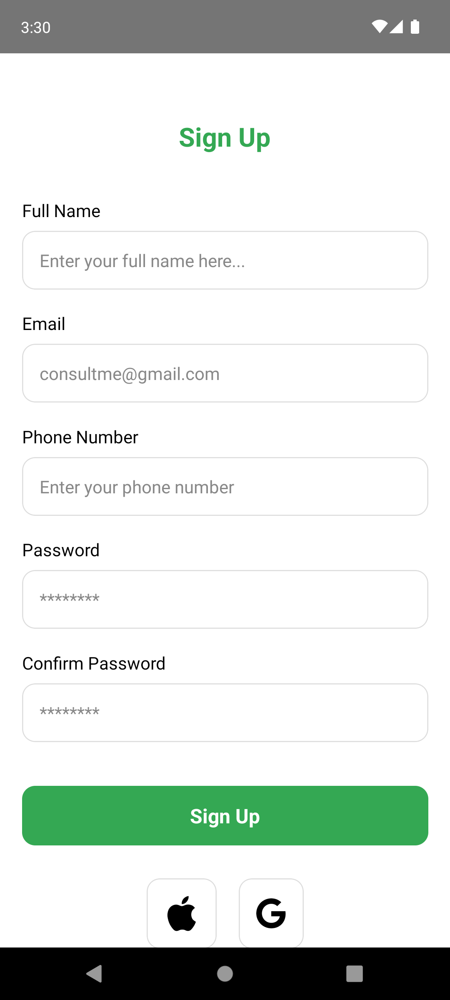  
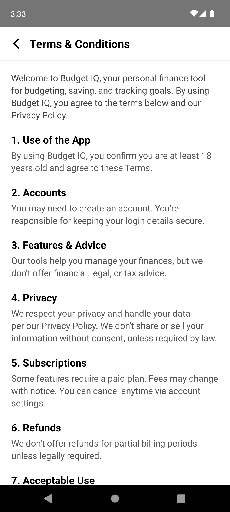  
  

---

## Folder Structure
```text
├── android/        # Android native project files
├── ios/            # iOS native project files
├── src/            # Source code
│   ├── components/ # Reusable components
│   ├── screens/    # App screens (Home, Income, Expense, Summary)
│   ├── assets/     # Images, icons, fonts
│   └── navigation/ # React Navigation setup
├── App.js          # Entry point
├── package.json
└── README.md


